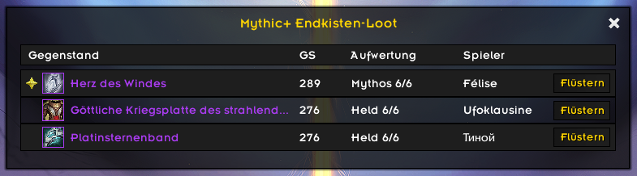

# ElvUI M+ Loot

**ElvUI M+ Loot** ist ein schlankes ElvUI-Plugin, das Mythic+ Gruppenloot in einem übersichtlichen, kompakten Fenster im ElvUI-Stil anzeigt.

Das Addon soll eine einfache Übersicht über Loot-Drops in Mythic+ Dungeons bieten, ohne das Interface unnötig zu überladen.

## Funktionen

- Zeigt Mythic+ Gruppenloot in einem eigenen ElvUI-Fenster an
- Erfasst Loot-Nachrichten von Gruppenmitgliedern
- Übersichtliches und kompaktes Layout
- Optisch an ElvUI angepasst
- Unterstützt englische und deutsche Clients
- Optionale KeystoneLoot-Wunschlisten-Erkennung
- Markiert KeystoneLoot-Wunschitems im Lootfenster
- Schlank und einfach zu bedienen

## Screenshots

## Voraussetzungen

- World of Warcraft Retail
- ElvUI
- KeystoneLoot ist optional und wird nur für die lesende Wunschlisten-Erkennung verwendet

## Installation

Lade die aktuelle Version herunter und entpacke den Ordner in dein World of Warcraft AddOns-Verzeichnis:

`World of Warcraft/_retail_/Interface/AddOns/`

Die finale Ordnerstruktur sollte so aussehen:

`World of Warcraft/_retail_/Interface/AddOns/ElvUI_MPlusLoot/`

## Nutzung

Nach der Installation ist keine zusätzliche Einrichtung notwendig.

Das Plugin erkennt automatisch den Loot aus der Endkiste eines Mythic+ Dungeons und zeigt die erhaltenen Gegenstände der Gruppenmitglieder in einem übersichtlichen ElvUI-Fenster an.

Wenn KeystoneLoot installiert ist und ein Gegenstand auf der KeystoneLoot-Wunschliste gefunden wird, wird der Gegenstand im Lootfenster markiert.

KeystoneLoot kann bei installierter Integration eigene Tooltip-Informationen anzeigen, ElvUI M+ Loot fügt aber keine zusätzliche eigene Tooltip-Zeile hinzu.

Die KeystoneLoot-Integration ist optional und nur lesend. Es werden keine KeystoneLoot-Dateien oder Daten kopiert oder verändert.

Das Fenster enthält:

- den erhaltenen Gegenstand
- die Gegenstandsstufe (GS)
- den Aufwertungspfad
- den Spielernamen
- einen Flüster-Button

Das Loot-Fenster kann manuell über folgende Befehle geöffnet werden: `/mploot` oder `/mplusloot`

Interne Testbefehle wie `/mplootfake` und `/mplootitem` sind in der öffentlichen Release-Version deaktiviert.

## Projektstatus

Dies ist eine frühe öffentliche Alpha-Version.

Der Fokus liegt aktuell auf der grundlegenden Mythic+ Loot-Erfassung und einer sauberen Darstellung im ElvUI-Stil. Weitere Funktionen können in zukünftigen Versionen folgen.

## Feedback und Fehlermeldungen

Fehler, Probleme oder Vorschläge können über GitHub Issues gemeldet werden.

## Offizielle Downloads

Bitte lade ElvUI M+ Loot nur aus offiziellen Quellen herunter:

- GitHub Releases
- CurseForge
- Wago
- WowUp

Inoffizielle Uploads oder veränderte Versionen werden nicht unterstützt.

## Hinweis

ElvUI M+ Loot ist ein unabhängiges Drittanbieter-Plugin für ElvUI.

Dieses Projekt ist nicht mit dem ElvUI-Entwicklerteam verbunden, wird nicht von diesem unterstützt und nicht von diesem gepflegt.

ElvUI wird für die Funktion dieses Addons benötigt, ist aber nicht Bestandteil dieses Projekts.

KeystoneLoot wird optional für die Wunschlisten-Erkennung unterstützt. Dieses Projekt ist nicht mit KeystoneLoot oder dessen Entwicklern verbunden, wird nicht von ihnen unterstützt und nicht von ihnen gepflegt.

Die KeystoneLoot-Integration ist nur lesend. Es werden keine KeystoneLoot-Dateien oder Daten kopiert, verändert oder verteilt.
