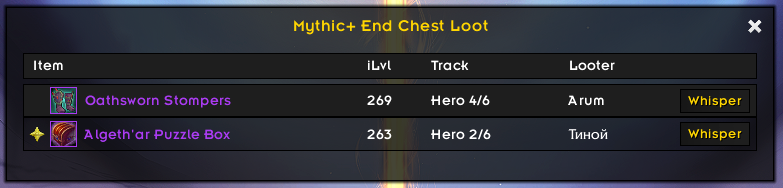

# ElvUI M+ Loot

**ElvUI M+ Loot** is a lightweight ElvUI plugin that displays Mythic+ group loot in a clean, compact ElvUI-style window.

The addon is designed to provide a simple overview of loot drops during Mythic+ dungeons without adding unnecessary clutter to the user interface.

## Features

- Displays Mythic+ group loot in a dedicated ElvUI-style window
- Tracks loot messages from party members
- Clean and compact layout
- Designed to visually match ElvUI
- Supports English and German clients
- Optional KeystoneLoot wishlist detection
- Marks KeystoneLoot wishlist items in the loot window
- Detects bonus loot and marks it as likely not tradeable
- Shows small EU realm-language flags next to looter names
- Lightweight and easy to use

## Screenshots

## Requirements

- World of Warcraft Retail
- ElvUI
- KeystoneLoot is optional and only used for read-only wishlist detection

## Installation

Download the latest release and extract the folder into your World of Warcraft AddOns directory:

`World of Warcraft/_retail_/Interface/AddOns/`

The final folder structure should look like this:

`World of Warcraft/_retail_/Interface/AddOns/ElvUI_MPlusLoot/`

## Usage

No additional setup is required after installation.

The plugin automatically detects loot from the final chest of a Mythic+ dungeon and displays the received items from group members in a clean ElvUI-style window.

If KeystoneLoot is installed and an item is found on the KeystoneLoot wishlist, the item is marked in the loot window.

KeystoneLoot may add its own tooltip information when installed, but ElvUI M+ Loot does not add an extra tooltip line.

The KeystoneLoot integration is optional and read-only. No KeystoneLoot files or data are copied or modified.

Bonus loot detected from loot messages is treated as likely not tradeable. These items are dimmed in the loot window, and the item tooltip explains why the item is shown that way.

The loot window can show small realm-language flags next to looter names. These flags indicate the realm language or locale, not the player's nationality. Realm-language flags are currently region-safe for EU realms; non-EU or unknown regions show no flag. Supported realm language groups are `de`, `en`, `fr`, `es`, `ru`, `it`, and `pt`.

The window shows:

- the received item
- the item level
- the upgrade track
- a realm-language flag when available
- the player name
- a whisper button

The loot window can be opened manually with the following commands: `/mploot` or `/mplusloot`

Internal test commands such as `/mplootfake` and `/mplootitem` are disabled in the public release build.

Flag asset credits are documented in `CREDITS.md`.

## Project Status

This is an early public alpha release.

The addon is currently focused on basic Mythic+ loot tracking and a clean ElvUI-style presentation. More features may be added in future versions.

## Feedback and Bug Reports

Please report bugs, issues, or suggestions via GitHub Issues.

## Official Downloads

Please download ElvUI M+ Loot only from official sources:

- GitHub Releases
- CurseForge
- Wago
- WowUp

Unofficial uploads or modified versions are not supported.

## Disclaimer

ElvUI M+ Loot is an independent third-party plugin for ElvUI.

This project is not affiliated with, endorsed by, or maintained by the ElvUI development team.

ElvUI is required for this addon to function, but ElvUI itself is not included in this project.

KeystoneLoot is optionally supported for wishlist detection. This project is not affiliated with, endorsed by, or maintained by the KeystoneLoot developers.

The KeystoneLoot integration is read-only. No KeystoneLoot files or data are copied, modified, or distributed.
